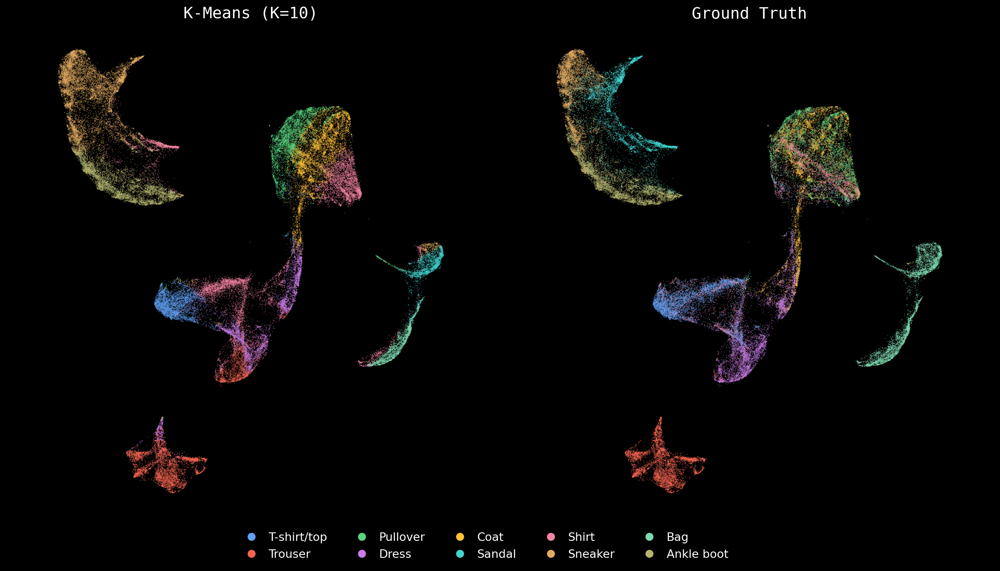
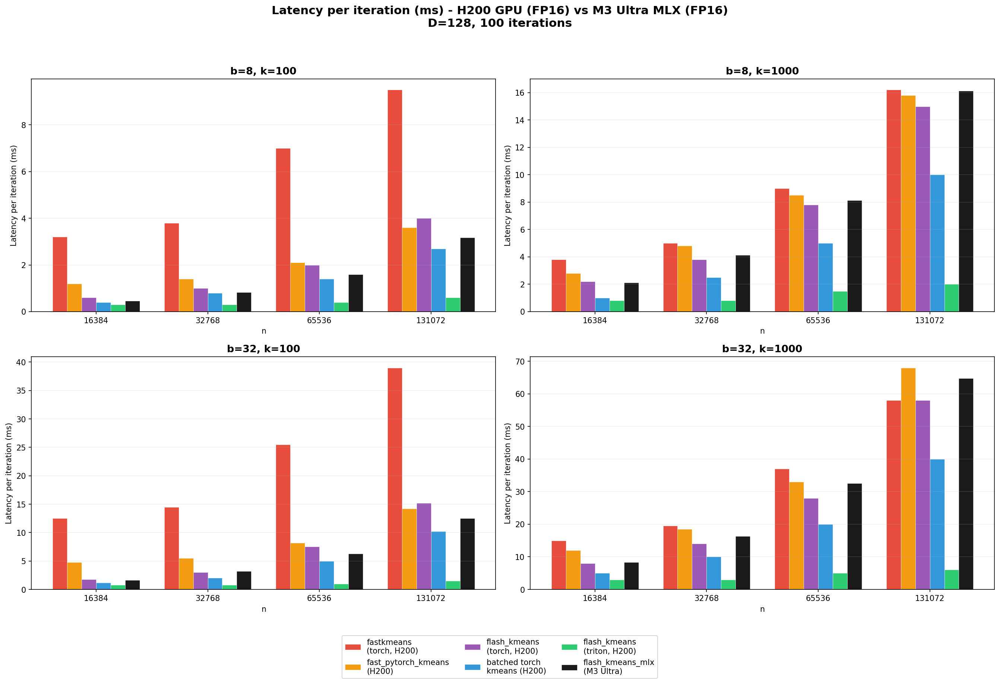

# flash-kmeans-mlx

IO-aware batched K-Means for Apple Silicon, ported from [Flash-KMeans](https://github.com/svg-project/flash-kmeans) (Triton/CUDA) to pure MLX.

500K points, 128 dimensions, K=1000 clustered in 0.76s on M3 Ultra -- 160x faster than sklearn. Uses custom Metal kernels for argmax, fused addmm assignment, and multi-iteration compiled execution.

Full Fashion-MNIST (70K samples, 784 dimensions, K=10) clustered in 0.12s on M3 Ultra, 6x faster than sklearn (0.74s). Left: K-Means cluster assignments. Right: ground truth labels. Visualization via [mlx-vis](https://github.com/hanxiao/mlx-vis) UMAP.



## Installation

```bash
uv pip install flash-kmeans-mlx
```

From source:

```bash
git clone https://github.com/hanxiao/flash-kmeans-mlx.git
cd flash-kmeans-mlx
uv pip install .
```

## Usage

### Functional API

```python
import mlx.core as mx
from flash_kmeans_mlx import batch_kmeans_Euclid

x = mx.random.normal((32, 75600, 128))
cluster_ids, centers, n_iters = batch_kmeans_Euclid(
    x, n_clusters=1000, tol=1e-4, verbose=True
)
```

Input shape is `(B, N, D)` where B is batch size, N is number of points, D is dimensionality. All batches are clustered independently in a single vectorized pass.

Three distance metrics are available: `batch_kmeans_Euclid`, `batch_kmeans_Cosine`, and `batch_kmeans_Dot`.

### Class API

```python
from flash_kmeans_mlx import FlashKMeans

model = FlashKMeans(d=128, k=1000, niter=25, tol=1e-6)
model.fit(x)
labels = model.predict(x_new)

# or in one step
labels = model.fit_predict(x)
```

The `FlashKMeans` class accepts both `(N, D)` and `(B, N, D)` inputs. Set `metric="cosine"` or `metric="dot"` to switch distance functions.

## Benchmark

All timings on M3 Ultra, float32, single batch. MLX uses `mx.compile`; sklearn uses Lloyd's algorithm on CPU (`n_init=1`).

| N | D | K | Iters | MLX | sklearn | Speedup |
|---|---|---|-------|-----|---------|---------|
| 5K | 64 | 50 | 10 | 2ms | 34ms | 17x |
| 50K | 128 | 256 | 20 | 7ms | 1.28s | 183x |
| 100K | 128 | 1000 | 20 | 32ms | 9.8s | 306x |
| 500K | 128 | 1000 | 10 | 77ms | 39.8s | 517x |

Run the benchmark yourself:

```bash
uv pip install 'flash-kmeans-mlx[benchmark]'
python -m flash_kmeans_mlx.benchmark --n 100000 --d 128 --k 1000 --max-iters 20
```

### vs H200 GPU

Comparison against the original Flash-KMeans and other PyTorch implementations on NVIDIA H200 (FP16). All methods run D=128, 100 iterations. MLX on M3 Ultra matches or beats naive PyTorch methods on H200, with the gap to the Triton kernel explained by the 37x raw compute difference (27 TFLOPS vs 990 TFLOPS).



## Correctness

Verified against sklearn with identical initial centroids over 20 iterations. Cluster assignment agreement is 92-99.8% depending on configuration, with inertia difference below 0.01%. The remaining discrepancy comes from float32 vs sklearn's float64 accumulation - boundary points near equidistant cluster borders get assigned differently due to rounding.

## Distance metrics

Euclidean (squared L2), Cosine (dot product on L2-normalized vectors), and Dot-product (raw inner product).

## Credits

This is an independent MLX port of [Flash-KMeans](https://github.com/svg-project/flash-kmeans) and is not affiliated with the original authors.

Papers:

- [Flash-KMeans: IO-Aware Batched K-Means](https://arxiv.org/abs/2603.09229) (Shuo Yang et al.)
- [Sparse VideoGen2](https://arxiv.org/abs/2505.18875) (Haocheng Xi, Shuo Yang et al.)

## License

Apache 2.0
